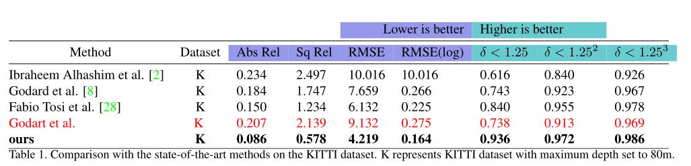

# MonoMeMa
A novel deep network for monocular depth estimation infusing of human depth perception knowledge. We are now tidying up the code and will upload the entire project soon, thanks for waiting!
 

Experiment results update!

The results in red was a new comparison with the latest supervised method from paper "Digging into Self-Supervised Monocular Depth Prediction".
Tips: To obtain the results in the table, generally we need to steps. First is to get disparity from the others' code, second is to caculate the object depth by average pooling method using the disparity map obtained in the first step. Thus the final results will be slightly lower than the pixel-level evaluations in the original papers.
